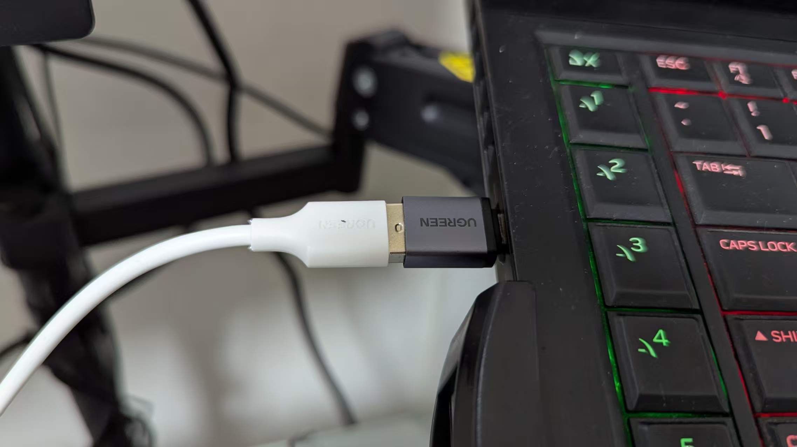
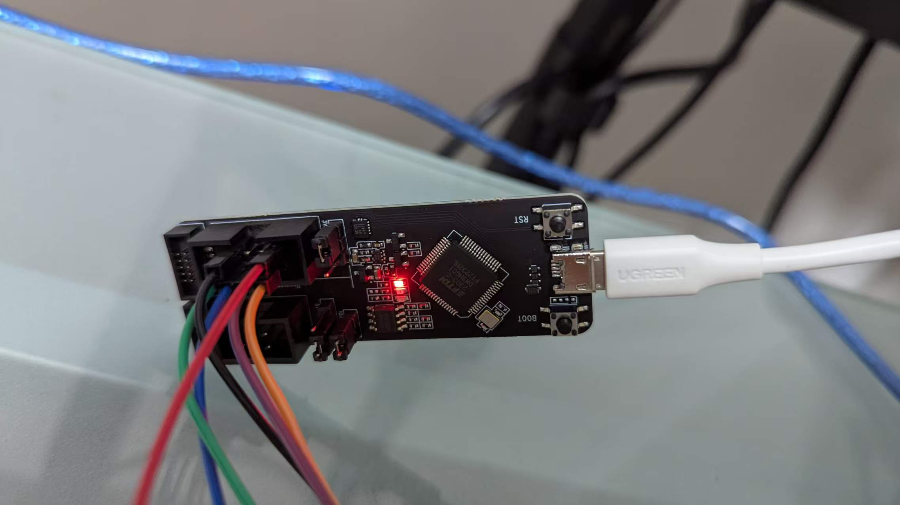
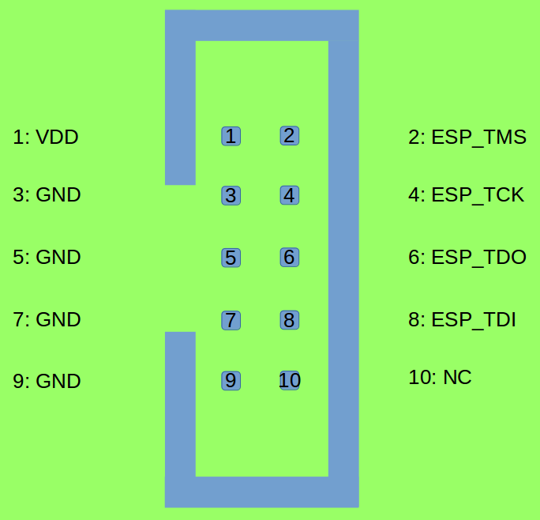
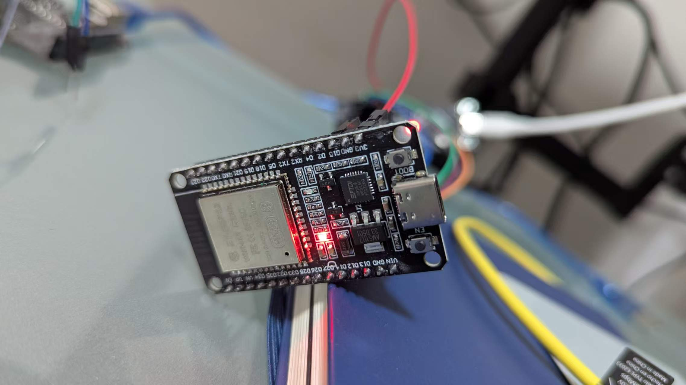
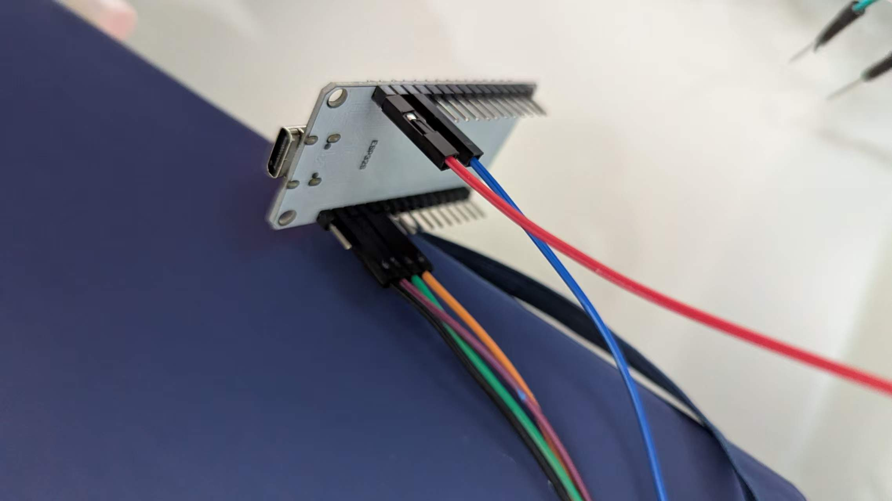
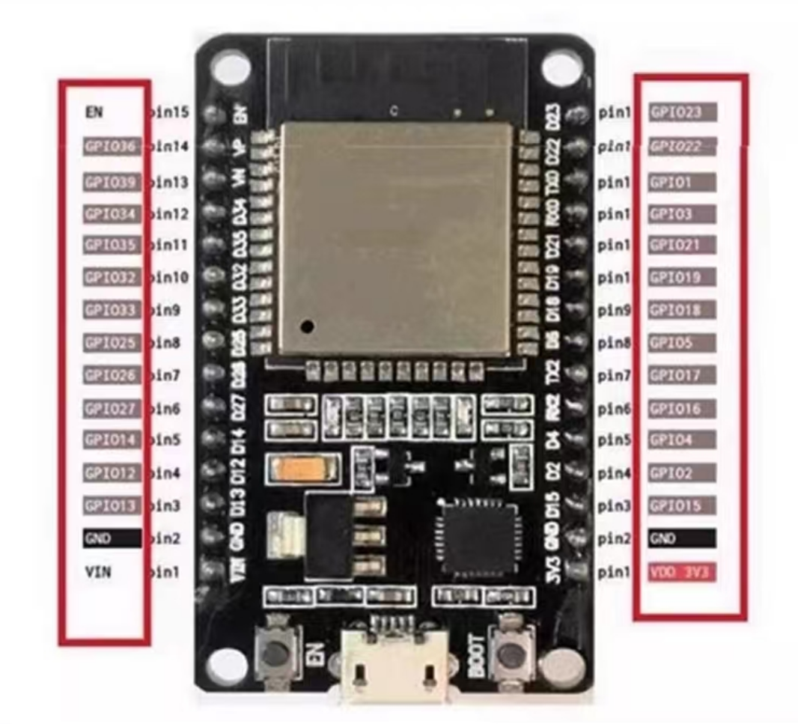
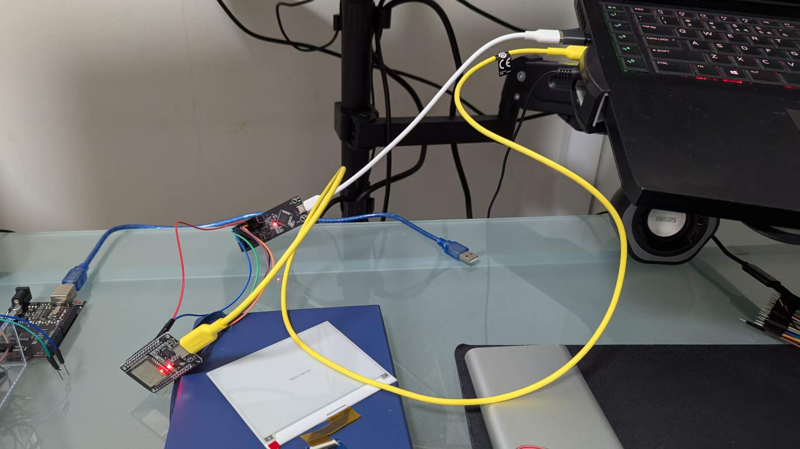
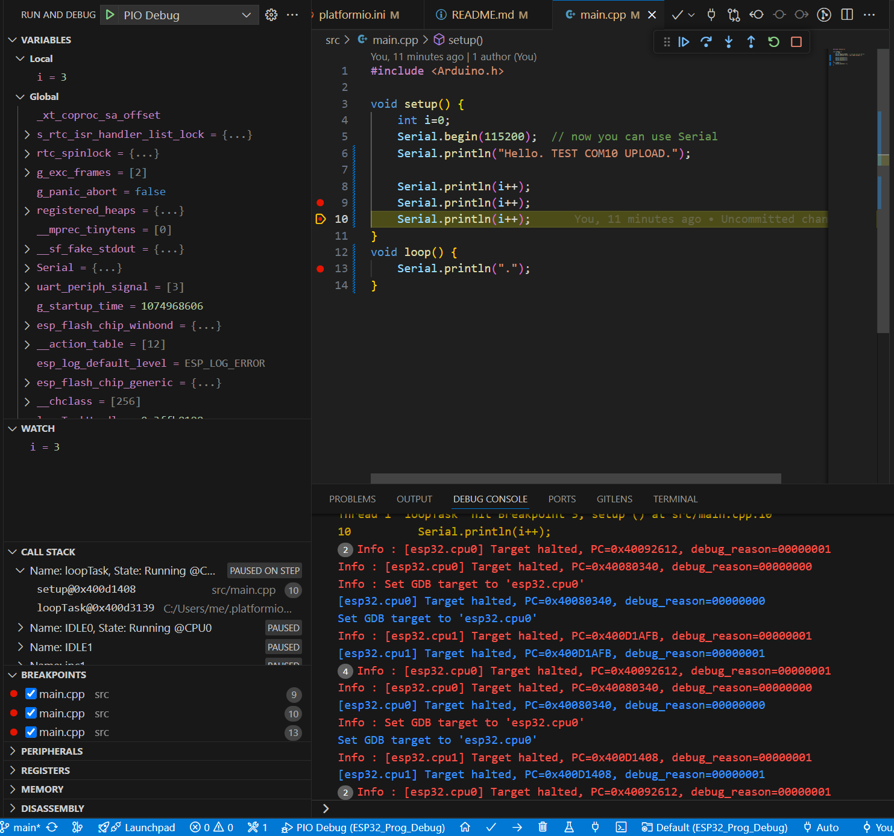

# ESP32-ESP-Prog-Debug

## Hardware


*Fig. 1 Connection Overview*


*Fig. 2 Connect USB cable to the Computer.*


*Fig. 2 Connect the other end of USB cable to ESP Prog board, use wires to connect JTAG interface.*


*Fig. 3 JTAG pins on ESP-Prog*

Fig. 3 is from ESP-Prog Guide:
https://docs.espressif.com/projects/esp-iot-solution/en/latest/hw-reference/ESP-Prog_guide.html


*Fig. 4 JTAG wires connect to ESP32 dev board.*


*Fig. 5 JTAG wires connect to ESP32 dev board. (Back)*


*Fig. 6 ESP32 dev board pins.*

My ESP32 board is a third-party dev board. The brand is TOUGLESY. I bought it from Taobao, and Fig. 6, the pin description, is from the Taobao page.

If you also want Serial printing, I assume yes, then connect another USB cable from computer directly to ESP32 dev board.

*Fig. 7 Overview after adding another USB cable (yellow) for Serial Monitor and Uploading.*


## Software

VS Code + PlatformIO

Two main files:
```
./platform.ini
./src/main.cpp
```

If you want to find out what COM your USB cable is using, on VS Code's bottom status bar, there's a plug icon with text `Auto`. Press that would give you a list of COMs, and you can easily guess the right one if there's only one USB cable plugged into the computer. In my case, I am using COM10 for the yellow cable both for Serial printing and uploading.

## Debugging Screenshot

F5 to start debugging.


