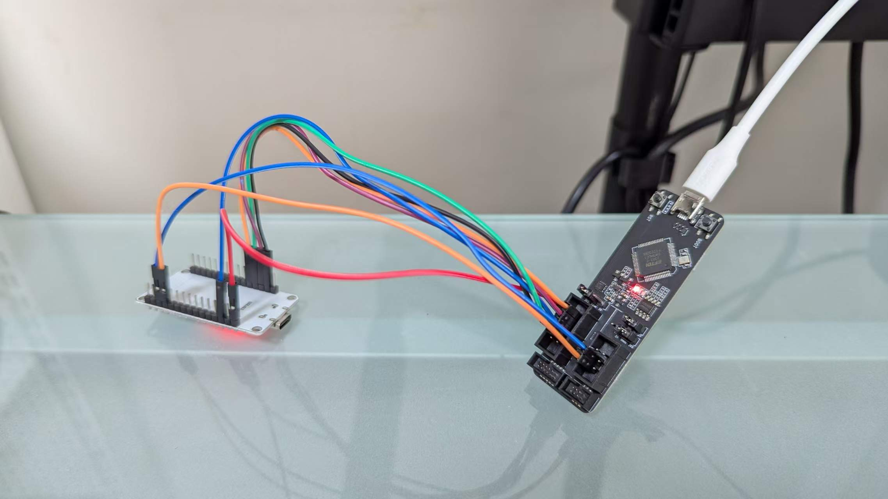
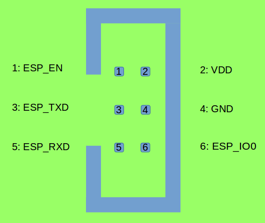

# ESP32-ESP-Prog-Debug

## Hardware


*Fig. 1 Connection Overview*


*Fig. 2 Connect USB cable to the Computer.*


*Fig. 2 Connect the other end of USB cable to ESP Prog board, use wires to connect JTAG interface.*


*Fig. 3 JTAG pins on ESP-Prog*

Fig. 3 is from ESP-Prog Guide:
https://docs.espressif.com/projects/esp-iot-solution/en/latest/hw-reference/ESP-Prog_guide.html


*Fig. 4 JTAG wires connect to ESP32 dev board.*


*Fig. 5 JTAG wires connect to ESP32 dev board. (Back)*

Connections:

| JTAG Signal | Default ESP32 GPIO Pin |
|-------------|---------------|
| TMS         | GPIO14        |
| TDI         | GPIO12        |
| TCK         | GPIO13        |
| TDO         | GPIO15        |

This pin map is from https://docs.espressif.com/projects/esp-idf/en/latest/esp32/api-guides/jtag-debugging/configure-ft2232h-jtag.html


*Fig. 6 ESP32 dev board pins.*

My ESP32 board is a third-party dev board. The brand is TOUGLESY. I bought it from Taobao, and Fig. 6, the pin description, is from the Taobao page.

## Serial Print and Monitor

### Option A: another USB cable

If you also want Serial printing, I assume yes, then connect another USB cable from computer directly to ESP32 dev board.

*Fig. 7.1 Overview after adding another USB cable (yellow) for Serial Monitor and Uploading.*

### Option B: Connect TX,RX between ESP32-Prog and ESP32


*Fig 7.2 TX/RX UART connections between ESP32-Prog and ESP32.*


*Fig 7.3 TX/RX UART on ESP32-Prog Program Interface.*

Note: Here `ESP_TXD` means you should connect this pin to `TXD` on ESP32. Don't connect it to `RXD`, or you'll get errors like:

```
Polling target esp32.cpu0 failed, trying to reexamine
Error: Unexpected OCD_ID = ffffffff
Examination failed, GDB will be halted. Polling again in 100ms
```

## Software

### USB driver


*Fig. 8 For Windows, use Zadig to change Driver of "Dual RS232-HS (Interface 0)" to WinUSB*

Fig. 8 is from https://docs.espressif.com/projects/esp-idf/en/latest/esp32/api-guides/jtag-debugging/configure-ft2232h-jtag.html

Zadig can be downloaded from https://zadig.akeo.ie/

### VS Code + PlatformIO

Two main files:
```
./platform.ini
./src/main.cpp
```

If you want to find out what COM your USB cable is using, on VS Code's bottom status bar, there's a plug icon with text `Auto`. Press that would give you a list of COMs, and you can easily guess the right one if there's only one USB cable plugged into the computer.

### Serial UART port
`monitor_port` and `upload_port` in `platformio.ini` should be modified accordingly.

In Option A (Fig. 7.1), I am using COM10 for the yellow cable both for Serial printing and uploading.

In Option B (Fig. 7.2), I am using COM16 for the white cable.

## Debugging Screenshot

F5 to start debugging.


